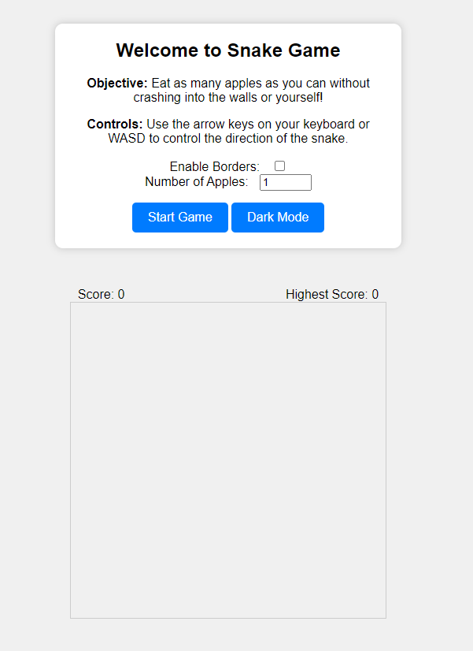
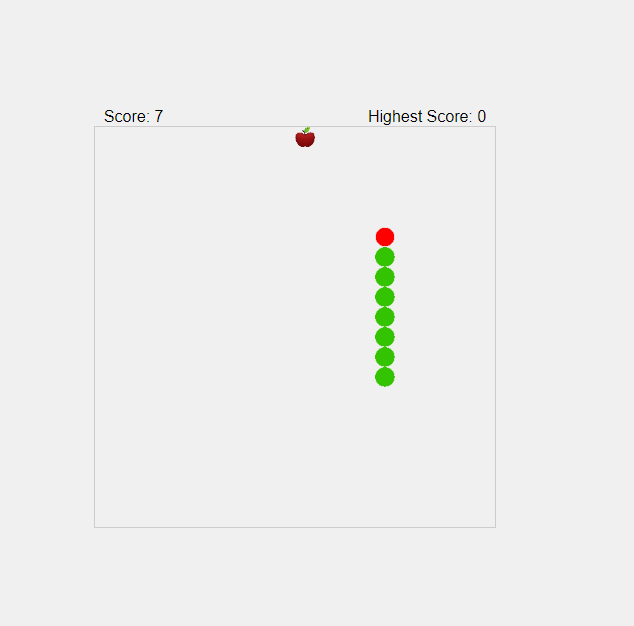
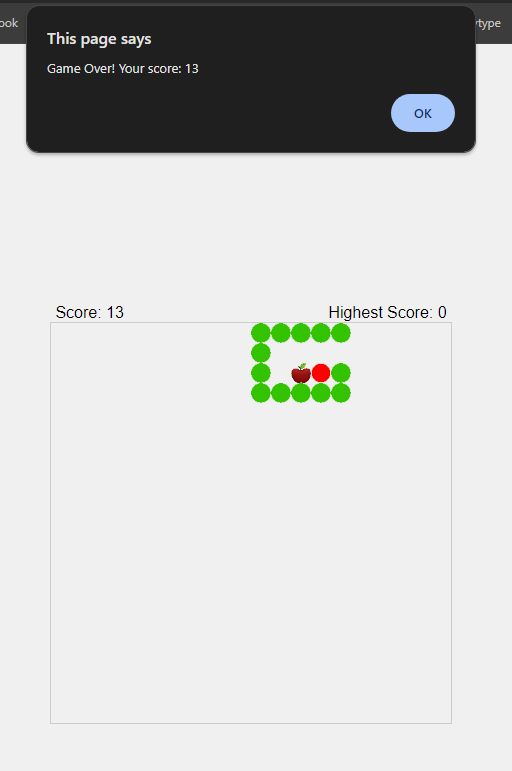

# Visual Design System for Snake Game

## Structural Components

| Component      | Description                                                                                   |
|----------------|-----------------------------------------------------------------------------------------------|
| Header         | The header contains the title of the game, "SNAKE - CSI3540" |
| Menu           | The menu section includes options for the player to configure the game settings before starting. It features checkboxes for enabling borders and input for selecting the number of apples. The "Start Game" button initiates gameplay, while the "Dark Mode" button toggles a darker tone of the website and the game. |
| Scoreboard     | The scoreboard displays the current score and the highest score achieved. I|
| Game Canvas    | The central component of the game, where the gameplay unfolds. The canvas visually represents the snake, apples, and game environment. |

## Palette of Colors

| Type        | Light Mode Color  | Dark Mode Color | 
|-------------|-------------------|------------------|
| Background  | #F0F0F0           | #333             | 
| Menu        | #FFFFFF           | #333                | 
| Text        | #000000           | #FFFFFF           | 

## Buttons

| State       | Default Color  | Hover Color | 
|-------------|----------------|-------------|
| Default     | #007BFF        | #0056B3     | 
## Scores

| Element     | Text Color |
|-------------|------------|
| Scores      | #000000     |

## Fonts and Sizes

| Type          | Font Family     | Size (px) | 
|---------------|-----------------|------------|
| Header        | Arial, sans-serif | 24         | 
| Menu Options  | Arial, sans-serif | 16         | 
| Buttons       | Arial, sans-serif | 16         | 
| Scores        | Arial, sans-serif | 16         | 

## Game Capture

| Element | Description |
| ------- | ----------- |
|  | The initial screen of the game, containing the main menu and a blank canvas of the game |
| | An ongoing game of Snake, without the menu |
|  | A completed game of Snake, where the player has lost. |